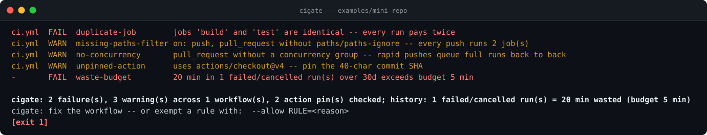
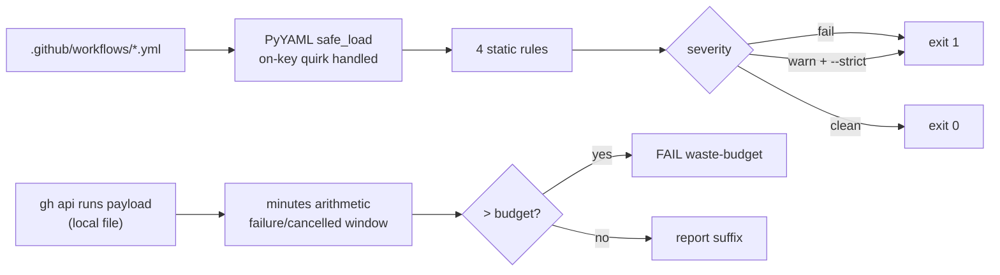

[](https://github.com/F0Rextasy/cigate/actions/workflows/test.yml)
[](https://www.python.org/)
[](https://pyyaml.org/)
[](#what-it-will-never-do)
[](https://skills.sh/F0Rextasy/cigate)
[](LICENSE)

# cigate

**Your Actions minutes are burning and nothing tells you.** Every push
runs the full matrix because nobody wrote `paths:`, two copy-pasted jobs
do identical work, superseded runs queue with no `concurrency` group,
and last month's failed runs quietly ate the quota. `cigate` reads
`.github/workflows/*.yml` as data, puts a number on the waste, and fails
the build when it crosses your budget.



## The problem is real

- The #1 complaint about AI-era development is the bill: usage shocks
  from agents that fire CI constantly make wasted minutes a *daily*
  loss, not a monthly footnote.
- The niche is pre-wave, not owned: `skill-ci-churn` (3 stars),
  `MinuteShield` (1 star) - nobody has a deterministic, offline,
  exit-code workflow-waste gate.
- Every rule here is byte-level static analysis + one arithmetic pass
  over a payload you already can capture with `gh api`.

## Quickstart

```bash
# install the skill into any agent (Claude Code, Codex, Cursor, OpenCode, ...):
npx skills add F0Rextasy/cigate

# or run it directly:
git clone https://github.com/F0Rextasy/cigate

# static pass over this repo, warnings block:
python cigate/scripts/cigate . --strict

# full pass: static + failed-run minute budget from a local capture:
gh api repos/OWNER/REPO/actions/runs --paginate > runs.json
python cigate/scripts/cigate . --runs-json runs.json --max-waste-minutes 60
```

Exit `1` = failure rule or budget exceeded (or any warning with
`--strict`), `0` = lean, `2` = usage error. Python3.8+ and
`pip install pyyaml`; **no network calls, ever** - history mode reads a
file.

## Usage patterns

| Situation | Command |
| --- |---|
| gate every PR that touches workflows | `cigate . --strict` |
| monthly quota review | `gh api repos/O/R/actions/runs --paginate > runs.json && cigate . --runs-json runs.json` |
| hard budget: never burn >60 wasted min/month | add `--max-waste-minutes 60` (fails CI) |
| wider window | `--runs-json runs.json --since-days 90` |
| one rule waived by policy (e.g. org pins tags) | `--allow unpinned-action=org policy` |
| machine-readable report | `--format json` -> `counts`, `waste`, `findings` |

## Rules

Findings name the workflow file (relative to `.github/workflows/`,
forward slashes on every OS):

| Rule | Severity | Fires when |
| --- | --- | --- |
| `unpinned-action` | warn | `uses:` target is not a full 40-char commit SHA (once per ref; local `./` and `docker://` skipped) |
| `missing-paths-filter` | warn | `push`/`pull_request` lacks `paths`/`paths-ignore` **and** the workflow is costly (>=2 jobs or a matrix) - docs-only commits should not run it |
| `no-concurrency` | warn | `pull_request` trigger without a top-level `concurrency` group - rapid pushes queue full runs back to back |
| `duplicate-job` | fail | two jobs with byte-identical bodies under different names - every run pays twice |
| `waste-budget` | fail | failed/cancelled/timed_out minutes in the window exceed `--max-waste-minutes` |
| `malformed-workflow` | warn | YAML cigate could not parse - reported, never silently skipped |

## How the pieces fit



## Evidence

Real output over the committed red example (also the demo above):

```console
$ python scripts/cigate examples/mini-repo --runs-json examples/runs.json --max-waste-minutes 5 --no-color
ci.yml  FAIL  duplicate-job        jobs 'build' and 'test' are identical -- every run pays twice
ci.yml  WARN  missing-paths-filter on: push, pull_request without paths/paths-ignore -- every push runs 2 job(s)
ci.yml  WARN  no-concurrency       pull_request without a concurrency group -- rapid pushes queue full runs back to back
ci.yml  WARN  unpinned-action      uses actions/checkout@v4 -- pin the 40-char commit SHA
-       FAIL  waste-budget         20 min in 1 failed/cancelled run(s) over 30d exceeds budget 5 min

cigate: 2 failure(s), 3 warning(s) across 1 workflow(s), 2 action pin(s) checked; history: 1 failed/cancelled run(s) = 20 min wasted (budget 5 min)
cigate: fix the workflow -- or exempt a rule with:  --allow RULE=<reason>
[exit 1]
```

Machine-readable verdict:

```json
{"ok": false, "counts": {"fail": 2, "warn": 3, "exempt": 0,
                          "workflows": 1, "uses": 2},
 "waste": {"failed_runs": 1, "minutes": 20, "window_days": 30, "budget": 5}}
```

Contract tests drive the real CLI over temp repos - YAML quirks, budget
math, exemption accounting included:

```console
$ python -m unittest discover -s tests -v
...
Ran 9 tests in 1.279s

OK
```

## Exemptions

`--allow RULE=reason` (repeatable) drops that **whole rule**, demands a
non-empty reason, and is echoed as `N exempt by --allow` in the summary
and `counts.exempt` in JSON. Unknown rules are usage errors.

## CI wiring

```yaml
- name: install parser
  run: pip install pyyaml
- name: workflows must be lean
  run: python scripts/cigate . --strict --no-color
- name: the red example must be caught
  run: |
    python scripts/cigate examples/mini-repo --runs-json examples/runs.json --max-waste-minutes 5 || test $? -eq 1
```

This repository's own [test workflow](.github/workflows/test.yml) runs
the middle step against **itself** with `--strict`: an unpinned action or
a missing concurrency group fails the build that would ship it.

## What it will never do

- **Call the network.** History mode parses a file you captured; same
  payload, same verdict, offline.
- **Estimate money it cannot defend.** The unit is *wasted minutes* -
  conversion to currency is yours, with your plan's rates.
- **Drop a rule quietly.** Exemptions are reasoned, counted, and visible
  in every output format.

## How it compares

*Caption: Context-compression tools on one machine — ours verifies bytes, they measure size.*

|tool|install|offline?|quality/byte-exact metric|license/key-caveat|
|---|---|---|---|---|
|**compressproof** (ours)|Python stdlib, no deps — clone/run|Yes|SHA-256 byte-exact round-trip + N/N needle-question oracle|MIT; committed red example runs in CI|
|**pxpipe**|`npm i -g pxpipe-proxy` / `npx pxpipe-proxy` (v0.13.2)|Yes (local proxy)|SWE-bench Lite 10/10 both arms; hex verbatim recall 13/15 (Fable 5) / 0/15 (Sol)|MIT; README states “It is lossy” — misses are silent confabulations|
|**context-mode**|`npm i -g context-mode` (Node >=22.5)|Yes (never phones home)|Size-ratio claim only (315 KB -> 5.4 KB, 98%); no quality/answer-retention numbers|Elastic-2.0 (not OSI-approved); reversible only via FTS5 section index|
|**headroom**|`pip install "headroom-ai[all]"` (PyPI; npm pkg has no CLI)|Yes for compression; telemetry beacon **on by default** (`HEADROOM_BEACON=off`)|GSM8K 0.870 -> 0.870; TruthfulQA delta inside +/-0.030 CI; SQuAD 97% @19% compression; proof table 21-57% saved|Apache-2.0; reversible via CCR cache, but phones home unless disabled|
|**RTK**|`winget install rtk-ai.rtk` (Rust single binary)|Yes|“Up to 90% of bash output” claim, honestly caveated as bytes/4 token estimate; no answer oracle|Apache-2.0; third-party JetBrains run: **+7.6% median cost/task** at low reasoning|
|**OmniRoute**|`npm i -g omniroute` (v3.8.50, ~452 MB unpacked, Node >=22.22)|Gateway local, but proxies to cloud model providers|Savings math only (89.2% avg stacked claim); no answer-retention metric|MIT; bloat (452 MB), mixed-lossy engines (byte-exact only for code/JSON)|
|**fast-jev-compaction**|`npm i fast-jev-compaction` (+ Claude Code plugin)|**No** — requires `TYPESAFE_API_KEY`, calls cloud Jev API (api.typesafe.ai)|reductionRatio/stats only (kept N/M messages); no precision/recall|MIT; deletes-only (never rewrites), but compaction decisions are cloud-issued|

*Caption: AI-prose detectors — only ours and unslop-check give checkable numbers without sending text anywhere.*

|tool|install|offline?|quality/precision metric|license/key-caveat|
|---|---|---|---|---|
|**aitell** (ours)|`npx skills add F0Rextasy/aitell`|Yes|Published confusion matrix; deterministic score|Deterministic — same input, same verdict, every run|
|**ai-detect**|`git clone github.com/houtini-ai/ai-detect && pip install .` (not on PyPI)|Yes, after 1.7 GB one-time model download (126 MB light)|Model RAID #1 backing + paired 92.6% vs 0.03%; no own P/R table|MIT (beta); pulls torch/transformers|
|**unslop-check**|`npm i -g unslop-check` (Node >=18)|Yes (pure stylometry, no model)|7 signals 0-1 + composite; calibration FPR floor 0.4% — distilled from unslop.run, not self-measured|MIT; reference data, not tool-measured precision/recall|
|**SaaS (GPTZero)**|Web/API — no offline CLI|No|Vendor-claimed accuracy only, unverifiable locally|Proprietary/paid; text leaves the machine (NDA risk)|

**Note:** axe CLI (`@axe-core/cli` v4.13.0) exits `1` on violations **only** with opt-in `-q`/`--exit` (default exit `0` even with findings) → our CI gate must pass `-q`; `file://` URLs pass through untouched.

## One path, many gates — the family

| Repo | What its verdict means |
| --- | ---|
| [dsh-gate](https://github.com/F0Rextasy/dsh-gate) | the shell session actually ran - real commands, real files, real log |
| [sessionaudit](https://github.com/F0Rextasy/sessionaudit) | the session behaved - scope, secrets, destructive acts, self-contradicted claims |
| [cigate](https://github.com/F0Rextasy/cigate) | the workflows burn each minute once - pins, path filters, dedup, budget |
| [ci-triage](https://github.com/F0Rextasy/ci-triage) | one log, one verdict: regression / flaky / infra / pass |
| [docproof](https://github.com/F0Rextasy/docproof) | every README doc snippet is runnable, parsed, and verified in CI |
| [preflight](https://github.com/F0Rextasy/preflight) | the config is safe to ship - semantics, not syntax |
| [prove-it](https://github.com/F0Rextasy/prove-it) | every claim in this README is backed by real, captured output |
| [shipcheck](https://github.com/F0Rextasy/shipcheck) | the artifacts in `dist/` match `src/` - nothing stale ships |
| [testgate](https://github.com/F0Rextasy/testgate) | the tests that ran are the tests that exist - gaps, dupes, skips |
| [bandaid](https://github.com/F0Rextasy/bandaid) | the diff doesn't hide a silent failure - swallowed errors, dead guards |
| [wincompat](https://github.com/F0Rextasy/wincompat) | every path in the tree survives a Windows checkout |
| [compressproof](https://github.com/F0Rextasy/compressproof) | the context shrank without losing an answer - reversible compression, byte proof, answer-equivalence oracle |
| [uigate](https://github.com/F0Rextasy/uigate) | the UI stops looking like the same AI slop - measurable design-slop lint, WCAG + template tells |
| [aitell](https://github.com/F0Rextasy/aitell) | the prose stops reading as AI - deterministic AI-tell detection with a published confusion matrix |
| [route-drift](https://github.com/F0Rextasy/route-drift) | OpenAPI spec vs code routes drift gate |

MIT licensed. New waste patterns welcome - attach the workflow snippet
and the minutes it burned.
